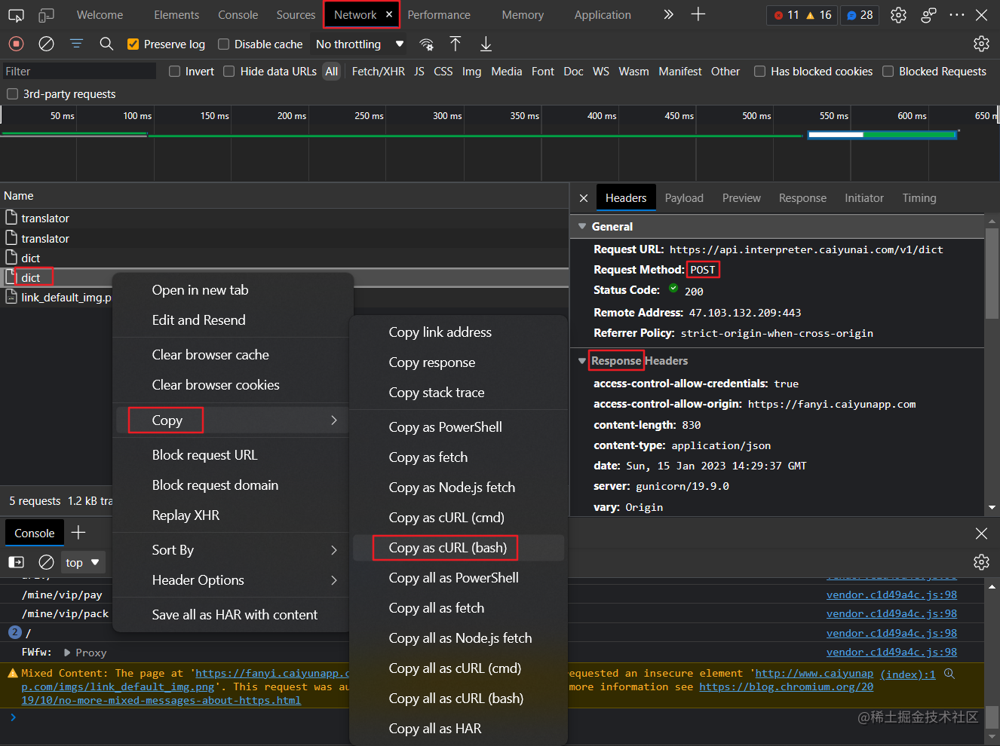

这是我参与「第五届青训营 」笔记创作活动的第1天

# 一、内容概览
+ Go 语言环境搭建
    + Windows 下 Go 环境搭建
    + Linux 下 Go 环境搭建
+ Go 语言基础语法
    + Hello World!
    + 其他
+ 实战
    + 猜谜游戏
    + 在线词典
    + SOCKS5 代理
# 二、知识点详解
## 1. Go 语言环境搭建
### 1.1 Windows 下 Go 环境搭建
+ 1.1.1 安装 Golang
  > [Go下载 - Go语言中文网 - Golang中文社区 (studygolang.com)](https://studygolang.com/dl)
  
  下载安装即可，安装过程勾选添加至系统环境变量，或者后续手动添加
  
+ 1.1.2 测试是否安装成功
  打开 Command Prompt
  ```bash
  C:\Users\Chang>go version
  go version go1.19.5 windows/amd64
  ```
  
+ 1.1.3 下载安装 GoLand
  > [GoLand by JetBrains: More than just a Go IDE](https://www.jetbrains.com/go/)
  
  下载安装，后续打开工程，软件会自动检测 GOPATH


### 1.2 Linux 下 Go 环境搭建
+ 1.2.1 下载压缩文件
  ```bash
  $ wget https://studygolang.com/dl/golang/go1.19.5.linux-amd64.tar.gz
  $ ls
  go1.19.5.linux-amd64.tar.gz
  ```

+ 1.2.2 解压至指定路径
  ```bash
  $ sudo tar -C /usr/local -xzf go1.19.5.linux-amd64.tar.gz
  [sudo] password for chang:
  $ cd /usr/local
  $ ls -l
  ···
  drwxr-xr-x 10 root root 4096 Jan 10 06:41 go
  ···
  ```

+ 1.2.3 建立 Go 工作空间
  + src: 里面每一个子目录，就是一个包。包内是Go的源码文件
  + pkg: 编译后生成的，包的目标文件
  + bin: 生成的可执行文件
  ```bash
  $ mkdir go
  $ ls
  go
  $ cd go
  $ mkdir src
  $ mkdir pkg
  $ mkdir bin
  $ ls
  bin  pkg  src
  $ chmod 777 src
  $ chmod 777 pkg
  $ chmod 777 bin
  ```

+ 1.2.4 设置环境变量
    + 方法一
      ```bash
      $ vi ~/.bashrc
      # Go environment 
      export PATH=$PATH:/usr/local/go/bin
      export GOPATH=/home/chang/Projects/go
      $ source ~/.bashrc
      ```
    + 方法二
      ```bash
      $ vi /etc/profile
      # Go environment
      export GOROOT=/usr/local/go
      export GOPATH=/home/chang/Projects/go
      export PATH=$PATH:$GOROOT/bin
      $ source $HOME/.profile
      ```

+ 1.2.5 测试 Go 语言环境
  ```bash
  $ go version
  go version go1.19.5 linux/amd64
  $ go env
  ···
  ```

+ 1.2.6 Hello World!
  ```bash
  $ vi hello.go
  package main
  import "fmt"
  func main() {
      fmt.Printf("Hello World!\n")
  }
  $ go run hello.go
  Hello World！
  ```

+ 1.2.7 VS Code 配置

  > [go语言环境搭建 - 个人文章 - SegmentFault 思否](https://segmentfault.com/a/1190000041065855)

  + 配置代理

     ```bash
     chang@C:~/Projects/go/src$ go env -w GOPROXY=https://goproxy.io,direct
     ```

     配置后 **重启 VS Code**

     + 安装 VsCode golang插件

     + 开启 MODULE 模式

       > 由于1.14版本之后推荐使用Go Modules管理，我们便不在GOPATH中存放工程路径
       >
       > + GO111MODULE=off 禁用模块支持，编译时会从GOPATH和vendor文件夹中查找包。
       > + GO111MODULE=on 启用模块支持，编译时会忽略GOPATH和vendor文件夹，只根据 go.mod下载依赖。
       > + GO111MODULE=auto，当项目在$GOPATH/src外且项目根目录有go.mod文件时，开启模块支持。

       ```bash
       go env -w GO111MODULE=on
       ```

     + 安装 Go tools

       + 新建工程文件夹

       + 新建源文件

       + 弹出 安装 Go tools, install all

         ```
         Tools environment: GOPATH=/home/chang/Projects/go
         Installing 7 tools at /home/chang/Projects/go/bin in module mode.
           gotests
           gomodifytags
           impl
           goplay
           dlv
           staticcheck
           gopls
         
         Installing github.com/cweill/gotests/gotests@v1.6.0 (/home/chang/Projects/go/bin/gotests) SUCCEEDED
         Installing github.com/fatih/gomodifytags@v1.16.0 (/home/chang/Projects/go/bin/gomodifytags) SUCCEEDED
         Installing github.com/josharian/impl@v1.1.0 (/home/chang/Projects/go/bin/impl) SUCCEEDED
         Installing github.com/haya14busa/goplay/cmd/goplay@v1.0.0 (/home/chang/Projects/go/bin/goplay) SUCCEEDED
         Installing github.com/go-delve/delve/cmd/dlv@latest (/home/chang/Projects/go/bin/dlv) SUCCEEDED
         Installing honnef.co/go/tools/cmd/staticcheck@latest (/home/chang/Projects/go/bin/staticcheck) SUCCEEDED
         Installing golang.org/x/tools/gopls@latest (/home/chang/Projects/go/bin/gopls) SUCCEEDED
         
         All tools successfully installed. You are ready to Go. :)
         ```

     + 初始化 Go Modules

       ```bash
       chang@C:/mnt/e/_cc/GitHub/Byte_YouthCamp5th/src/test_prj$ go mod init test_prj
       go: creating new go.mod: module test_prj
       go: to add module requirements and sums:
               go mod tidy
       ```

     + F5即可调试运行


+ 1.2.8 GOLANG MODULE

    + go mod init：初始化go mod， **生成go.mod文件**，后可接参数指定 module 名
    + go mod download：手动触发下载依赖包到本地cache（默认为$GOPATH/pkg/mod目录）
    + go list -m -json all：以 json 的方式打印依赖详情
    + go mod tidy ：添加缺少的包，且删除无用的包

    ---

    + go mod graph： 打印项目的模块依赖结构
    + go mod verify ：校验模块是否被篡改过
    + go mod why： 查看为什么需要依赖
    + go mod vendor ：导出项目所有依赖到vendor下
    + go mod edit ：编辑go.mod文件

## 2. Go 基础语法
### 2.1 Hello World!
```go
// hello.go
package main  // 指定 hello.go 文件属于 main 包
import "fmt"  // 导入标准库包
func main() { // main 函数, 程序入口 
    fmt.Printf("Hello World!\n")  // 打印 Hello World!
}
```
go 的文件需指定所在的包，如本例中 `package main` 指定了 hello.go 文件属于 main 包，main 包有唯一的 main 函数，为程序入口，只有 main 包可编译成可执行文件。

```bash
  $ go run hello.go 
  hello world
  $ go build hello.go
  $ ls
  hello  hello.go
  $ ./hello
Hello World!
```

### 2.2 基础语法
> [Go by Example 中文 (studygolang.com)](http://books.studygolang.com/gobyexample/)
+ 变量

  ```go
  package main
  
  import (
  	"fmt"
  	"math"
  )
  
  func main() {
  
  	var a = "initial"
  	var b, c int = 1, 2
  	var d = true
  	var e float64
  	f := float32(e)
  	g := a + "foo"
  	fmt.Println(a, b, c, d, e, f) // initial 1 2 true 0 0
  	fmt.Println(g)                // initialapple
  
  	const s string = "constant"
  	const h = 500000000
  	const i = 3e20 / h
  	fmt.Println(s, h, i, math.Sin(h), math.Sin(i))
  }
  ```

+ if-else

  ```go
  package main
  
  import "fmt"
  
  func main() {
  
  	if 7%2 == 0 {
  		fmt.Println("7 is even")
  	} else {
  		fmt.Println("7 is odd")
  	}
  
  	if 8%4 == 0 {
  		fmt.Println("8 is divisible by 4")
  	}
  
  	if num := 9; num < 0 {
  		fmt.Println(num, "is negative")
  	} else if num < 10 {
  		fmt.Println(num, "has 1 digit")
  	} else {
  		fmt.Println(num, "has multiple digits")
  	}
  }
  ```

+ for

  ```go
  package main
  
  import "fmt"
  
  func main() {
  
  	i := 1
  	for {
  		fmt.Println("loop")
  		break
  	}
  	for j := 7; j < 9; j++ {
  		fmt.Println(j)
  	}
  
  	for n := 0; n < 5; n++ {
  		if n%2 == 0 {
  			continue
  		}
  		fmt.Println(n)
  	}
  	for i <= 3 {
  		fmt.Println(i)
  		i = i + 1
  	}
  }
  ```

+ switch

  ```go
  package main
  
  import (
  	"fmt"
  	"time"
  )
  
  func main() {
  
  	a := 2
  	switch a {
  	case 1:
  		fmt.Println("one")
  	case 2:
  		fmt.Println("two")
  	case 3:
  		fmt.Println("three")
  	case 4, 5:
  		fmt.Println("four or five")
  	default:
  		fmt.Println("other")
  	}
  
  	t := time.Now()
  	switch {
  	case t.Hour() < 12:
  		fmt.Println("It's before noon")
  	default:
  		fmt.Println("It's after noon")
  	}
  }
  ```

+ 数组

  ```go
  package main
  
  import "fmt"
  
  func main() {
  
  	var a [5]int
  	a[4] = 100
  	fmt.Println("get:", a[2])
  	fmt.Println("len:", len(a))
  
  	b := [5]int{1, 2, 3, 4, 5}
  	fmt.Println(b)
  
  	var twoD [2][3]int
  	for i := 0; i < 2; i++ {
  		for j := 0; j < 3; j++ {
  			twoD[i][j] = i + j
  		}
  	}
  	fmt.Println("2d: ", twoD)
  }
  ```

+ 切片

  ```go
  package main
  
  import "fmt"
  
  func main() {
  
  	s := make([]string, 3)
  	s[0] = "a"
  	s[1] = "b"
  	s[2] = "c"
  	fmt.Println("get:", s[2])   // c
  	fmt.Println("len:", len(s)) // 3
  
  	s = append(s, "d")
  	s = append(s, "e", "f")
  	fmt.Println(s) // [a b c d e f]
  
  	c := make([]string, len(s))
  	copy(c, s)
  	fmt.Println(c) // [a b c d e f]
  
  	fmt.Println(s[2:5]) // [c d e]
  	fmt.Println(s[:5])  // [a b c d e]
  	fmt.Println(s[2:])  // [c d e f]
  
  	good := []string{"g", "o", "o", "d"}
  	fmt.Println(good) // [g o o d]
  }
  ```

+ map

  ```go
  package main
  
  import "fmt"
  
  func main() {
  	m := make(map[string]int)
  	m["one"] = 1
  	m["two"] = 2
  	fmt.Println(m)           // map[one:1 two:2]
  	fmt.Println(len(m))      // 2
  	fmt.Println(m["one"])    // 1
  	fmt.Println(m["unknow"]) // 0
  
  	r, ok := m["unknow"]
  	fmt.Println(r, ok) // 0 false
  
  	delete(m, "one")
  
  	m2 := map[string]int{"one": 1, "two": 2}
  	var m3 = map[string]int{"one": 1, "two": 2}
  	fmt.Println(m2, m3)
  }
  ```

+ range

  ```go
  package main
  
  import "fmt"
  
  func main() {
  	m := make(map[string]int)
  	m["one"] = 1
  	m["two"] = 2
  	fmt.Println(m)           // map[one:1 two:2]
  	fmt.Println(len(m))      // 2
  	fmt.Println(m["one"])    // 1
  	fmt.Println(m["unknow"]) // 0
  
  	r, ok := m["unknow"]
  	fmt.Println(r, ok) // 0 false
  
  	delete(m, "one")
  
  	m2 := map[string]int{"one": 1, "two": 2}
  	var m3 = map[string]int{"one": 1, "two": 2}
  	fmt.Println(m2, m3)
  }
  ```

+ 函数

  ```go
  package main
  
  import "fmt"
  
  func add(a int, b int) int {
  	return a + b
  }
  
  func add2(a, b int) int {
  	return a + b
  }
  
  func exists(m map[string]string, k string) (v string, ok bool) {
  	v, ok = m[k]
  	return v, ok
  }
  
  func main() {
  	res := add(1, 2)
  	fmt.Println(res) // 3
  
  	v, ok := exists(map[string]string{"a": "A"}, "a")
  	fmt.Println(v, ok) // A True
  }
  ```

+ 指针

  ```go
  package main
  
  import "fmt"
  
  func add2(n int) {
  	n += 2
  }
  
  func add2ptr(n *int) {
  	*n += 2
  }
  
  func main() {
  	n := 5
  	add2(n)
  	fmt.Println(n) // 5
  	add2ptr(&n)
  	fmt.Println(n) // 7
  }
  ```

+ 结构体

  ```go
  package main
  
  import "fmt"
  
  type user struct {
  	name     string
  	password string
  }
  
  func main() {
  	a := user{name: "wang", password: "1024"}
  	b := user{"wang", "1024"}
  	c := user{name: "wang"}
  	c.password = "1024"
  	var d user
  	d.name = "wang"
  	d.password = "1024"
  
  	fmt.Println(a, b, c, d)                 // {wang 1024} {wang 1024} {wang 1024} {wang 1024}
  	fmt.Println(checkPassword(a, "haha"))   // false
  	fmt.Println(checkPassword2(&a, "haha")) // false
  }
  
  func checkPassword(u user, password string) bool {
  	return u.password == password
  }
  
  func checkPassword2(u *user, password string) bool {
  	return u.password == password
  }
  ```

+ 结构体方法

  ```go
  package main
  
  import "fmt"
  
  type user struct {
  	name     string
  	password string
  }
  
  func (u user) checkPassword(password string) bool {
  	return u.password == password
  }
  
  func (u *user) resetPassword(password string) {
  	u.password = password
  }
  
  func main() {
  	a := user{name: "wang", password: "1024"}
  	a.resetPassword("2048")
  	fmt.Println(a.checkPassword("2048")) // true
  }
  ```

+ 错误处理

  ```go
  package main
  
  import (
  	"errors"
  	"fmt"
  )
  
  type user struct {
  	name     string
  	password string
  }
  
  func findUser(users []user, name string) (v *user, err error) {
  	for _, u := range users {
  		if u.name == name {
  			return &u, nil
  		}
  	}
  	return nil, errors.New("not found")
  }
  
  func main() {
  	u, err := findUser([]user{{"wang", "1024"}}, "wang")
  	if err != nil {
  		fmt.Println(err)
  		return
  	}
  	fmt.Println(u.name) // wang
  
  	if u, err := findUser([]user{{"wang", "1024"}}, "li"); err != nil {
  		fmt.Println(err) // not found
  		return
  	} else {
  		fmt.Println(u.name)
  	}
  }
  ```

+ 字符串操作

  ```go
  package main
  
  import (
  	"fmt"
  	"strings"
  )
  
  func main() {
  	a := "hello"
  	fmt.Println(strings.Contains(a, "ll"))                // true
  	fmt.Println(strings.Count(a, "l"))                    // 2
  	fmt.Println(strings.HasPrefix(a, "he"))               // true
  	fmt.Println(strings.HasSuffix(a, "llo"))              // true
  	fmt.Println(strings.Index(a, "ll"))                   // 2
  	fmt.Println(strings.Join([]string{"he", "llo"}, "-")) // he-llo
  	fmt.Println(strings.Repeat(a, 2))                     // hellohello
  	fmt.Println(strings.Replace(a, "e", "E", -1))         // hEllo
  	fmt.Println(strings.Split("a-b-c", "-"))              // [a b c]
  	fmt.Println(strings.ToLower(a))                       // hello
  	fmt.Println(strings.ToUpper(a))                       // HELLO
  	fmt.Println(len(a))                                   // 5
  	b := "你好"
  	fmt.Println(len(b)) // 6
  }
  ```

+ 字符串格式化

  ```go
  package main
  
  import "fmt"
  
  type point struct {
  	x, y int
  }
  
  func main() {
  	s := "hello"
  	n := 123
  	p := point{1, 2}
  	fmt.Println(s, n) // hello 123
  	fmt.Println(p)    // {1 2}
  
  	fmt.Printf("s=%v\n", s)  // s=hello
  	fmt.Printf("n=%v\n", n)  // n=123
  	fmt.Printf("p=%v\n", p)  // p={1 2}
  	fmt.Printf("p=%+v\n", p) // p={x:1 y:2}
  	fmt.Printf("p=%#v\n", p) // p=main.point{x:1, y:2}
  
  	f := 3.141592653
  	fmt.Println(f)          // 3.141592653
  	fmt.Printf("%.2f\n", f) // 3.14
  }
  ```

+ JSON 处理

  ```go
  package main
  
  import (
  	"encoding/json"
  	"fmt"
  )
  
  type userInfo struct {
  	Name  string
  	Age   int `json:"age"`
  	Hobby []string
  }
  
  func main() {
  	a := userInfo{Name: "wang", Age: 18, Hobby: []string{"Golang", "TypeScript"}}
  	buf, err := json.Marshal(a)
  	if err != nil {
  		panic(err)
  	}
  	fmt.Println(buf)         // [123 34 78 97...]
  	fmt.Println(string(buf)) // {"Name":"wang","age":18,"Hobby":["Golang","TypeScript"]}
  
  	buf, err = json.MarshalIndent(a, "", "\t")
  	if err != nil {
  		panic(err)
  	}
  	fmt.Println(string(buf))
  
  	var b userInfo
  	err = json.Unmarshal(buf, &b)
  	if err != nil {
  		panic(err)
  	}
  	fmt.Printf("%#v\n", b) // main.userInfo{Name:"wang", Age:18, Hobby:[]string{"Golang", "TypeScript"}}
  }
  ```

+ 时间处理

  ```go
  package main
  
  import (
  	"fmt"
  	"time"
  )
  
  func main() {
  	now := time.Now()
  	fmt.Println(now) // 2022-03-27 18:04:59.433297 +0800 CST m=+0.000087933
  	t := time.Date(2022, 3, 27, 1, 25, 36, 0, time.UTC)
  	t2 := time.Date(2022, 3, 27, 2, 30, 36, 0, time.UTC)
  	fmt.Println(t)                                                  // 2022-03-27 01:25:36 +0000 UTC
  	fmt.Println(t.Year(), t.Month(), t.Day(), t.Hour(), t.Minute()) // 2022 March 27 1 25
  	fmt.Println(t.Format("2006-01-02 15:04:05"))                    // 2022-03-27 01:25:36
  	diff := t2.Sub(t)
  	fmt.Println(diff)                           // 1h5m0s
  	fmt.Println(diff.Minutes(), diff.Seconds()) // 65 3900
  	t3, err := time.Parse("2006-01-02 15:04:05", "2022-03-27 01:25:36")
  	if err != nil {
  		panic(err)
  	}
  	fmt.Println(t3 == t)    // true
  	fmt.Println(now.Unix()) // 1648738080
  }
  ```

+ 数字解析

  ```go
  package main
  
  import (
  	"fmt"
  	"strconv"
  )
  
  func main() {
  	f, _ := strconv.ParseFloat("1.234", 64)
  	fmt.Println(f) // 1.234
  
  	n, _ := strconv.ParseInt("111", 10, 64)
  	fmt.Println(n) // 111
  
  	n, _ = strconv.ParseInt("0x1000", 0, 64)
  	fmt.Println(n) // 4096
  
  	n2, _ := strconv.Atoi("123")
  	fmt.Println(n2) // 123
  
  	n2, err := strconv.Atoi("AAA")
  	fmt.Println(n2, err) // 0 strconv.Atoi: parsing "AAA": invalid syntax
  }
  ```

+ 进程信息

  ```go
  package main
  
  import (
  	"fmt"
  	"os"
  	"os/exec"
  )
  
  func main() {
  	// go run example/20-env/main.go a b c d
  	fmt.Println(os.Args)           // [/var/folders/8p/n34xxfnx38dg8bv_x8l62t_m0000gn/T/go-build3406981276/b001/exe/main a b c d]
  	fmt.Println(os.Getenv("PATH")) // /usr/local/go/bin...
  	fmt.Println(os.Setenv("AA", "BB"))
  
  	buf, err := exec.Command("grep", "127.0.0.1", "/etc/hosts").CombinedOutput()
  	if err != nil {
  		panic(err)
  	}
  	fmt.Println(string(buf)) // 127.0.0.1       localhost
  }
  ```
# 三、实践
> [wangkechun/go-by-example (github.com)](https://github.com/wangkechun/go-by-example)
## 1. 猜谜游戏
### 1.1 流程
1. 生成随机数
2. 读取用户输入
3. 判断逻辑
4. 游戏循环
### 1.2 代码实现
```go
package main

import (
    "bufio"
    "fmt"
    "math/rand"
    "os"
    "strconv"
    "strings"
    "time"
)

func main() {
    // 1. 生成随机数
    maxNum := 100  // 设置待猜测数字的最大值
    rand.Seed(time.Now().UnixNano())  // 设置随机数种子
    secretNumber := rand.Intn(maxNum)  // 生成随机数
    // fmt.Println("The secret number is ", secretNumber)  // 调式时查看生成的随机数

    fmt.Println("Please input your guess")  // 提示用户输入
    reader := bufio.NewReader(os.Stdin)  // 有缓冲的 I/O, 接收用户输入 【可简化】
    
    // 4. 游戏循环, 用户不断猜测直到猜正确
    for {
        // 2. 读取用户输入
        input, err := reader.ReadString('\n')  // 
        if err != nil {
            fmt.Println("An error occured while reading input. Please try again", err)
            continue
        }
        
        input = strings.Trim(input, "\r\n")  // 删除输入参数的回车、换行
        
        guess, err := strconv.Atoi(input)  // 输入字符串类型转 int
        if err != nil {
            fmt.Println("Invalid input. Please enter an integer value")
            continue
        }
        fmt.Println("You guess is", guess)
        // 3. 判断逻辑
        if guess > secretNumber {
            fmt.Println("Your guess is bigger than the secret number. Please try again")
        } 
        else if guess < secretNumber {
            fmt.Println("Your guess is smaller than the secret number. Please try again")
        } 
        else {
            fmt.Println("Correct, you Legend!")
            break
        }
    }
}
```
### 1.3 改进
fmt.Scanf 简化输入
```go
package main

import (
    "fmt"
    "math/rand"
    "time"
)

func main() {
    var guess int
    maxNum := 100
    rand.Seed(time.Now().UnixNano())
    secretNumber := rand.Intn(maxNum)
    // fmt.Println("The secret number is ", secretNumber)
    fmt.Println("Please input your guess")
    for {
        fmt.Scanf("%d", &guess)
        fmt.Println("You guess is", guess)
        if guess > secretNumber {
            fmt.Println("Your guess is bigger than the secret number. Please try again")
        } 
        else if guess < secretNumber {
            fmt.Println("Your guess is smaller than the secret number. Please try again")
        } 
        else {
            fmt.Println("Correct, you Legend!")
            break
        }
    }
}
```
## 2. 在线词典
### 2.1 知识点
+ Go 发送 Http 请求
+ 解析 JSON
+ curl 请求生成为 Go 代码

### 2.2 流程
1. 抓包：查看[彩云小译](https://fanyi.caiyunapp.com/#/)翻译时发送的 request 及 response

    

2. curl 请求生成 go 代码
    > [Convert curl to Go (curlconverter.com)](https://curlconverter.com/go/)

    ```go
    package main
    
    import (
        "fmt"
        "io/ioutil"
        "log"
        "net/http"
        "strings"
    )
    
    func main() {
        client := &http.Client{}
        var data = strings.NewReader(`{"trans_type":"en2zh","source":"hello"}`)
        req, err := http.NewRequest("POST", "https://api.interpreter.caiyunai.com/v1/dict", data)
        if err != nil {
            log.Fatal(err)
        }
        req.Header.Set("authority", "api.interpreter.caiyunai.com")
        req.Header.Set("accept", "application/json, text/plain, */*")
        req.Header.Set("accept-language", "en-US,en;q=0.9,zh-CN;q=0.8,zh;q=0.7")
        req.Header.Set("app-name", "xy")
        req.Header.Set("content-type", "application/json;charset=UTF-8")
        req.Header.Set("device-id", "")
        req.Header.Set("dnt", "1")
        req.Header.Set("origin", "https://fanyi.caiyunapp.com")
        req.Header.Set("os-type", "web")
        req.Header.Set("os-version", "")
        req.Header.Set("referer", "https://fanyi.caiyunapp.com/")
        req.Header.Set("sec-ch-ua", `"Not?A_Brand";v="8", "Chromium";v="108", "Microsoft Edge";v="108"`)
        req.Header.Set("sec-ch-ua-mobile", "?0")
        req.Header.Set("sec-ch-ua-platform", `"Windows"`)
        req.Header.Set("sec-fetch-dest", "empty")
        req.Header.Set("sec-fetch-mode", "cors")
        req.Header.Set("sec-fetch-site", "cross-site")
        req.Header.Set("user-agent", "Mozilla/5.0 (Windows NT 10.0; Win64; x64) AppleWebKit/537.36 (KHTML, like Gecko) Chrome/108.0.0.0 Safari/537.36 Edg/108.0.1462.76")
        req.Header.Set("x-authorization", "token:qgemv4jr1y38jyq6vhvi")
        resp, err := client.Do(req)
        if err != nil {
            log.Fatal(err)
        }
        defer resp.Body.Close()
        bodyText, err := ioutil.ReadAll(resp.Body)
        if err != nil {
            log.Fatal(err)
        }
        fmt.Printf("%s\n", bodyText)
    }
    ```

3. request 的 json 序列化

    上一步生成的 go http 请求代码的输入为固定的字符串输入，需要将输入修改为变量
    ```go
    type DictRequest struct {
        TransType string `json:"trans_type"`
        Source    string `json:"source"`
        UserID    string `json:"user_id"`
    }
    
    func main() {
        client := &http.Client{}
        
        // var data = strings.NewReader(`{"trans_type":"en2zh","source":"hello"}`)
        
        // json 序列化
        request := DictRequest{TransType: "en2zh", Source: "hello"}
        buf, err := json.Marshal(request)
        if err != nil {
            log.Fatal(err)
        }
        var data = bytes.NewReader(buf)
        
        req, err := http.NewRequest("POST", "https://api.interpreter.caiyunai.com/v1/dict", data)
        ···
    }
    ```
4. response 的 json 生成结构体
    > [JSON转Golang Struct - 在线工具 - OKTools](https://oktools.net/json2go)

5. response 的 json 反序列化
    ```go
    package main
    
    import (
        "fmt"
        "io/ioutil"
        "log"
        "net/http"
        "strings"
    )
    
    type DictRequest struct {
        TransType string `json:"trans_type"`
        Source    string `json:"source"`
        UserID    string `json:"user_id"`
    }
    
    type DictResponse struct {
        ···
    } 
    
    func main() {
        client := &http.Client{}
        
        // json 序列化
        request := DictRequest{TransType: "en2zh", Source: "hello"}
        buf, err := json.Marshal(request)
        if err != nil {
            log.Fatal(err)
        }
        var data = bytes.NewReader(buf)
        
        req, err := http.NewRequest("POST", "https://api.interpreter.caiyunai.com/v1/dict", data)
        if err != nil {
            log.Fatal(err)
        }
        ···
        resp, err := client.Do(req)
        if err != nil {
            log.Fatal(err)
        }
        defer resp.Body.Close()
        bodyText, err := ioutil.ReadAll(resp.Body)
        if err != nil {
            log.Fatal(err)
        }
        // fmt.Printf("%s\n", bodyText)
        
        // json 反序列化
        var dictResponse DictResponse
        err = json.Unmarshal(bodyText, &dictResponse)
        if err != nil {
            log.Fatal(err)
        }
        fmt.Println(word, "UK:", dictResponse.Dictionary.Prons.En, "US:", dictResponse.Dictionary.Prons.EnUs)
        for _, item := range dictResponse.Dictionary.Explanations {
            fmt.Println(item)
        }
    }
    ```
### 2.3 代码实现
```go
package main

import (
    "bytes"
    "encoding/json"
    "fmt"
    "io/ioutil"
    "log"
    "net/http"
    "os"
)

type DictRequest struct {
    TransType string `json:"trans_type"`
    Source    string `json:"source"`
    UserID    string `json:"user_id"`
}

type DictResponse struct {
    ···
}

func query(word string) {
    client := &http.Client{}
    
    request := DictRequest{TransType: "en2zh", Source: word}
    buf, err := json.Marshal(request)
    if err != nil {
        log.Fatal(err)
    }
    var data = bytes.NewReader(buf)
    req, err := http.NewRequest("POST", "https://api.interpreter.caiyunai.com/v1/dict", data)
    if err != nil {
        log.Fatal(err)
    }
    ···
    resp, err := client.Do(req)
    if err != nil {
        log.Fatal(err)
    }
    defer resp.Body.Close()
    bodyText, err := ioutil.ReadAll(resp.Body)
    if err != nil {
        log.Fatal(err)
    }
    if resp.StatusCode != 200 {
        log.Fatal("bad StatusCode:", resp.StatusCode, "body", string(bodyText))
    }
    
    var dictResponse DictResponse
    err = json.Unmarshal(bodyText, &dictResponse)
    if err != nil {
        log.Fatal(err)
    }
    fmt.Println(word, "UK:", dictResponse.Dictionary.Prons.En, "US:", dictResponse.Dictionary.Prons.EnUs)
    for _, item := range dictResponse.Dictionary.Explanations {
        fmt.Println(item)
    }
}

func main() {
    if len(os.Args) != 2 {
        fmt.Fprintf(os.Stderr, `usage: simpleDict WORD example: simpleDict hello`)
        os.Exit(1)
    }
    word := os.Args[1]
    query(word)
}
```
### 2.4 改进
+ 增加另一种翻译引擎的支持
+ 并行请求两个翻译引擎提高响应速度

## 3. SOCKS5 代理
# 四、总结
+ Go 基础语法
+ Go 发送 Http 请求
+ curl 请求生成 go 代码
+ json 生成 go 结构体
+ SOCKS5 协议

# 五、参考
+ [go语言环境搭建 - 个人文章 - SegmentFault 思否](https://segmentfault.com/a/1190000041065855)
+ [Go by Example 中文 (studygolang.com)](http://books.studygolang.com/gobyexample/)
+ [wangkechun/go-by-example (github.com)](https://github.com/wangkechun/go-by-example)