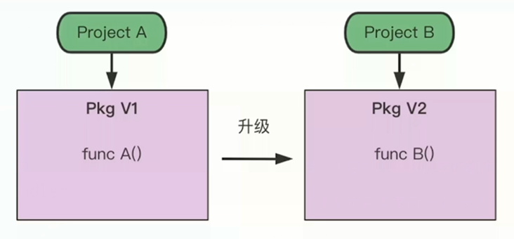
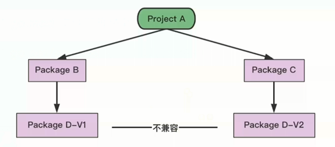
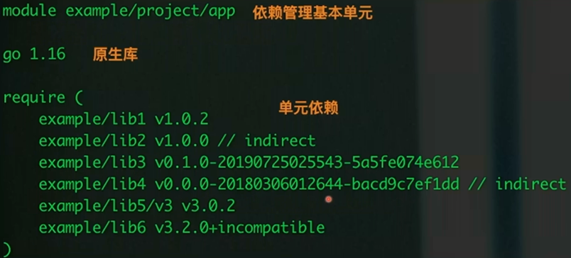
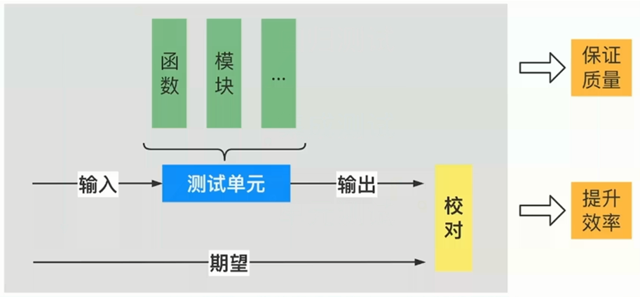
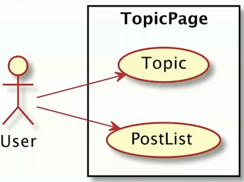
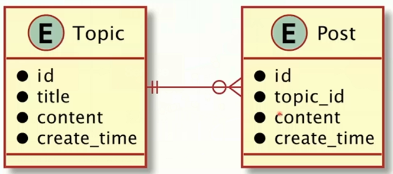
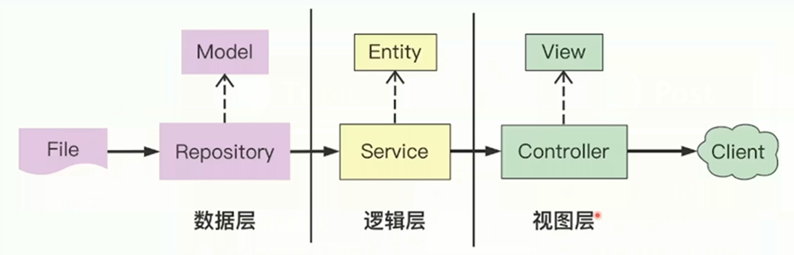

这是我参与「第五届青训营 」笔记创作活动的第2天

# 一、内容概览

+ Go 语言高性能本质

  + goroutine
+ channel
  + 并发安全 
+ WaitGroup
+ 依赖管理

  + Go 依赖管理演进历史
  + Go Module 实践
+ 测试

  + 单元测试
  + Mock 测试
  + 基准测试
+ 项目实践

  + 需求设计
  + 代码开发
  + 测试运行

# 二、知识点详解

## 1. Go 语言高性能本质

Go 可以充分发挥多核优势，高效运行

> + 并发：两个或多个事件在同一时间间隔内发生。这些事件在宏观上是同时发生，但在微观上是交替发生的；
> + 并行：两个或多个事件在**同一时刻**同时发生；
> + 单核 CPU 同一时刻只能执行一个程序，各程序只能**并发**执行；n 核 CPU 同一时刻可同时执行 n 个程序，称这 n 个程序并行执行

### 1.1 goroutine
> [协程（coroutine）简介 - DoubleLi - 博客园 (cnblogs.com)](https://www.cnblogs.com/lidabo/p/15745123.html)
>
> [goroutine和coroutine的区别 (biancheng.net)](http://c.biancheng.net/view/96.html)
>
> coroutine, 协程, 可简单认为协程是线程里不同的函数。
>
> + 线程：内核态，线程并发跑多个协程，栈 MB 级别
> + 协程：用户态，轻量级线程，栈 KB 级别

```go
package main

import (
    "fmt"
    "time"
)

func hello(i int) {
    println("hello goroutine : " + fmt.Sprint(i))
}

func HelloGoRoutine() {
    for i := 0; i < 5; i++ {
        // go 创建协程
        go func(j int) {
            hello(j)
        }(i)
    }

    // 阻塞, 保证子协程执行完前主协程不退出, 可优化
    time.Sleep(time.Second)
}

func main() {
    HelloGoRoutine()
}
```

输出，乱序输出，说明 `hello(i int)` 函数并发执行

```bash
$ go run helloGoroutine.go 
hello goroutine : 4
hello goroutine : 2
hello goroutine : 0
hello goroutine : 1
hello goroutine : 3
```

### 1.2 channel

> 多个 goroutine 为了争抢数据，势必造成执行的低效率，使用队列的方式是最高效的，channel 就是一种队列一样的结构

+ CSP, Communicating Sequential Processes

  + 传统的多线程：通过共享内存来通信
  + CSP：以通信的方式来共享内存” 

+ Go 语言创建 channel 方式

  + [Go语言无缓冲的通道 ](http://c.biancheng.net/view/4359.html)
  + [Go语言带缓冲的通道 ](http://c.biancheng.net/view/100.html)

  ```go
  make(chan int)     // 无缓冲通道
  make(chan int, 2)  // 有缓冲通道
  ```

+ 代码示例

  dest 使用有缓冲通道，原因：协程 B 作为生产者，主协程作为消费者，考虑到主协程遍历 dest channel 时，执行复杂操作，耗时长，避免消费者执行速度问题影响生产者执行效率（因主协程执行慢造成协程 B 阻塞）

  ```go
  package main
  
  func CalSquare() {
      src := make(chan int)
      dest := make(chan int, 3)  
      
      // 子协程A 发送 0~9 数字
      go func() {
          defer close(src)
          for i := 0; i < 10; i++ {
              src <- i
          }
      }()
      
      // 子协程B 计算输入数字的平方
      go func() {
          defer close(dest)
          for i := range src {
              dest <- i * i
          }
      }()
      
      // 主协程输出最后的平方数
      for i:= range dest {
          // 其他复杂操作
          println(i)
      }
  }
  ```

  顺序输出，channel 保证并发安全

### 1.3 Lock 实现并发安全 

channel 是通过通信共享内存，该节测试通过共享内存进行通信

```go
package main

import (
	"sync"
	"time"
)

var (
	x    int64
	lock sync.Mutex
)

func addWithLock() {
	for i := 0; i < 2000; i++ {
		lock.Lock()
		x += 1
		lock.Unlock()
	}
}

func addWithoutLock() {
	for i := 0; i < 2000; i++ {
		x += 1
	}
}

// 测试函数
func Add() {
	x = 0
	for i := 0; i < 5; i++ {
		go addWithoutLock()
	}
	time.Sleep(time.Second)
	println("WithoutLock: ", x)

	x = 0
	for i := 0; i < 5; i++ {
		go addWithLock()
	}
	time.Sleep(time.Second)
	println("WithLock: ", x)
}

func main() {
	Add()
}
```

个人运行结果，加锁与不加锁都能正确输出，待后续自查

### 1.4 WaitGroup 实现并发下同步 

内部维护一个计数器：开启协程 +1，执行结束 -1，著协诚阻塞直到计数器为 0

```go
package main

import (
	"fmt"
	"sync"
)

func hello(i int) {
	println("hello goroutine : " + fmt.Sprint(i))
}

func ManyGoWait() {
	var wg sync.WaitGroup
	wg.Add(5) // 计数器 +5
	for i := 0; i < 5; i++ {
		go func(j int) {
			defer wg.Done() // 计数器 -1
			hello(j)
		}(i)
	}
	wg.Wait() // 阻塞直到计数器为 0
}

func main() {
	ManyGoWait()
}
```

## 2. 依赖管理

### 2.1 演进

+ GOPATH

  ```bash
  . 
  ├── bin  # 项目编译的二进制文件
  ├── pkg  # 项目编译的中间产物，加速编译
  └── src  # 项目源码
  ```

  弊端：无法实现 package 的多版本控制

  

+ Go Vendor

  + 项目目录下增加 vendor 文件夹，依赖包副本形式放在 ./vendor 

  + 依赖寻址方式：vendor, GOPATH

  + 弊端：无法控制依赖的版本；更新项目又可能出现依赖冲突，导致编译出错

    

+ Go Module

  + 通过 go.mod 文件管理依赖包版本

  + 通过 `go get` / `go mod` 指令工具管理依赖包

  + 依赖管理三要素

    + 配置文件，描述依赖 → go.mod
    + 中心仓库管理依赖库 → Proxy
    + 本地工具                    → `go get` / `go mod` 


### 2.2 Module

+ go.mod 文件示例

    + 依赖标识：[Module Path] [Version/Pseudo-version]
    + indirect 表示间接依赖
    + incompatible 表示没有 go.mod 文件的包

    

+ Proxy 依赖分发

+ `go get` / `go mod`  工具

    ```bash
    go mod init      # 初始化，创建 go.mod 文件
    go mod download  # 下载模块到本地缓存
    go mod tidy      # 增加需要的依赖，删除不需要的依赖
    ```

## 3. 测试

测试是避免事故的最后一道屏障

测试分类：

+ 回归测试：手动通过终端回归主流场景 → 如，刷抖音
+ 集成测试：对系统功能的测试验证，对服务暴露的接口进行自动化测试
+ 单元测试：测试开发阶段，开发者对单独的函数模块

### 3.1 单元测试



+ 规则

  + 测试文件以 `_test.go` 结尾
  + 测试函数命名 `func TestXxx(*testing.T)`
  + 初始化逻辑放到 `TestMain` 中

+ 例子

  ```go
  func HelloTom() string {
      return "Jerry"
  }
  ```

  ```go
  func TestHelloTom(t *testing.T) {
      output := HelloTom()
      expectOutput := "Tom"
      if output != expectOutput {
          t.Errorf("Expected %s do not match actual %s", expectOutput, output)
      }
  }
  ```

+ 覆盖率

  ```go
  // judgement.go
  package test
  func JudgePassLine(score int 16) bool {
      if score >= 60 {
          return true
      }
      return false
  }
  ```

  ```go
  // judgement_test.go
  package test
  
  import (
  	"github.com/stretchr/testify/assert"
  	"testing"
  )
  
  func TestJudgePassLineTrue(t *testing.T) {
      isPass := JudgePassLine(70)
      assert.Equal(t, true, isPass)
  }
  
  func TestJudgePassLineFail(t *testing.T) {
      isPass := JudgePassLine(50)
      assert.Equal(t, false, isPass)
  }
  ```

  ```bash
  $ go test judgement_test.go judgement.go --cover
  ok      command-line-arguments  0.003s  coverage: 100.0% of statements
  ```

+ Tips
  + 一般覆盖率；50%~60%，较高覆盖率 80%+
  + 测试分支相互独立、全面覆盖
  + 测试单元粒度足够小，函数单一职责

### 3.2 Mock 测试

用函数 A(打桩函数) 替换 函数 B(原函数)，运行时对函数地址进行替换

+ 例子：测试函数依赖测试文件

  ```go
  func ReadFirstLine() string {
      open, err := os Open("log")
      defer open.Close()
      if err != nil {
          return ""
      }
      scanner := bufio.NewScanner(open)
      for scanner.Scan() {
          return scanner.Text()
      }
      return ""
  }
  
  func ProcessFirstLine() string {
      line := ReadFirstLine()
      destLine := strings.ReplaceAll(line, "11", "00")
      return destLine
  }
  ```

  ```go
  func TestProcessFirstLine(t *testing.T) {
      firstLine := ProcessFirstLine()
      assert.Equal(t, "line00", firstline)
  }
  ```

+ 打桩测试，不再依赖本地文件

  ```go
  import (
  	"github.com/bouk/monkey"
  )
  func TestProcessFirstLine(t *testing.T) {
      
      // 用 func() string {···} 替换 ReadFirstLine 函数
      monkey.Pathch(ReadFirstLine, func() string {
          return "line110"
      })
      
      // 打桩函数卸载
      defer monkey.Unpathch(ReadFirstLine)
      line := ProcessFirstLine()
      assert.Equal(t, "line000", line)
  }
  ```

### 3.3 基准测试

+ 优化代码

+ 内置的测试框架提供了基准测试的能力

+ 例子

  ```go
  // load_balance_selector.go
  package benchmark
  
  import (
  	"github.com/bytedance/gopkg/lang/fastrand"
  	"math/rand"
  )
  
  var ServerIndex [10]int
  
  func InitServerIndex() {
  	for i := 0; i < 10; i++ {
  		ServerIndex[i] = i+100
  	}
  }
  
  func Select() int {
  	return ServerIndex[rand.Intn(10)]
  }
  
  func FastSelect() int {
  	return ServerIndex[fastrand.Intn(10)]
  }
  ```

  ```go
  // load_balance_selector_test.go
  package benchmark
  
  import (
  	"testing"
  )
  
  func BenchmarkSelect(b *testing.B) {
  	InitServerIndex()
  	b.ResetTimer()
  	for i := 0; i < b.N; i++ {
  		Select()
  	}
  }
  func BenchmarkSelectParallel(b *testing.B) {
  	InitServerIndex()
  	b.ResetTimer()
  	b.RunParallel(func(pb *testing.PB) {
  		for pb.Next() {
  			Select()
  		}
  	})
  }
  func BenchmarkFastSelectParallel(b *testing.B) {
  	InitServerIndex()
  	b.ResetTimer()
  	b.RunParallel(func(pb *testing.PB) {
  		for pb.Next() {
  			FastSelect()
  		}
  	})
  }
  ```

# 三、实践——社区话题页面

## 1. 项目需求

+ 展式话题（标题，文字描述）和回帖列表
+ 仅实现本地 web 服务，不考虑前端页面实现
+ 话题和回帖数据用文件存储

## 2. 需求用例



## 3. ER 图（Entity Relationship Diagram）

话题（topic）和 帖子（post）是一对多的关系 



## 4. 分层结构



+ 数据层：数据 Model，外部数据的增删改查
+ 逻辑层：业务 Entity，处理核心业务逻辑输出
+ 视图层：视图 view，处理和外部的交互逻辑

## 5. 组件工具

+ [Gin 高性能 go web 框架](https://github.com/gin-gonic/gin)

+ Go Mod

  ```bash
  $ go mod init
  $ go get gopkg.in/gin-gonic/gin.v1@v1.3.0
  ```

## 6. 具体实现

### 6.1 Repository

+ topic 和 post 结构体设计
+ index
+ 查询

### 6.2 Service

+ 实体
+ 流程

### 6.3 Controller

### 6.4 Router

+ 初始化数据索引
+ 初始化引擎配置
+ 构建路由
+ 启动服务

### 6.5 运行

# 四、总结

+ Go: goroutine + channel + sync
+ 测试方式
+ 社区话题页面 Web 服务【和后续大项目实现很相关啊】

# 五、参考

+ [协程（coroutine）简介 - DoubleLi - 博客园 (cnblogs.com)](https://www.cnblogs.com/lidabo/p/15745123.html)

+ [goroutine和coroutine的区别 (biancheng.net)](http://c.biancheng.net/view/96.html)
+ [Go语言并发，Golang并发 (biancheng.net)](http://c.biancheng.net/golang/concurrent/)