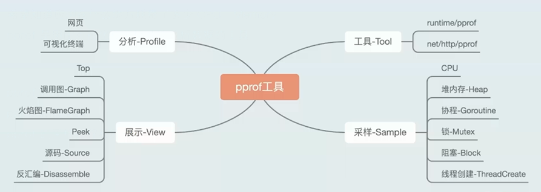
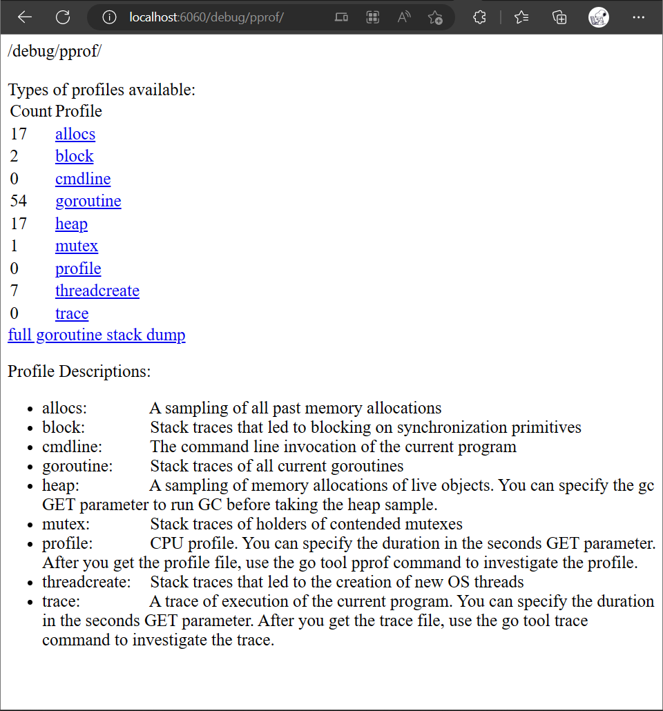
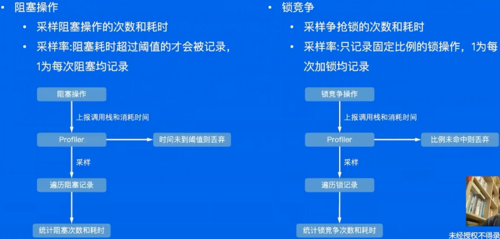

这是我参与「第五届青训营 」笔记创作活动的第3天

# 一、内容概览

+ 高质量编程
  + 简介
  + 编码规范
  + 性能优化建议
+ 性能调优
  + 简介
  + 性能分析工具 pprof
+ 性能调优案例

# 二、知识点详解

## 1. 高质量编程

## 1.1 简介

高质量：编写的代码正确可靠、简洁清晰

+ 正确性：各种边界条件是否考虑完备，错误的调用是否能够处理
+ 可靠性：异常情况或者错误的处理策略是否明确，依赖的服务出现异常是否能够处理
+ 简洁：逻辑是否简单，后续调整功能或新增功能是否能够快速支持
+ 清晰：易读易维护

## 1.2 编码规范

> + [CodeReviewComments · golang/go Wiki (github.com)](https://github.com/golang/go/wiki/CodeReviewComments)
>
> + [uber-go/guide: The Uber Go Style Guide. (github.com)](https://github.com/uber-go/guide)

1. 代码格式

   + gofmt
   + goimports

2. 注释

   + 解释代码作用
   + 解释代码如何做的
   + 解释代码实现的原因
   + 解释代码什么情况出错
   + 公共符号始终要注释

3. 命名规范

   + variable
     + 简洁胜于冗长
     + 缩略词全大写，但当其位于变量开头且不需要导出时，使用全小写
     + 变量距离其被使用的地方越远，则需要携带越多的上下文信息
       + 全局变量在其名字中需要更多的上下文信息，使得在不同地方可以轻易辨认出其含义
   + function
     + 函数名不携带包名的上下文信息，因为包名和函数名总是成对出现的
     + 函数名尽量简短
     + 当名为 foo 的包某个函数返回类型 Foo 时，可以省略类型信息而不导致歧义
     + 当名为 foo 的包某个函数返回类型 T 时（T 并不是 Foo），可以在函数名中加入类型信息
   + package
     + 只由小写字母组成。不包含大写字母和下划线等字符
     + 简短并包含一定的上下文信息。例如 schema、task 等
     + 不要与标准库同名。例如不要使用 sync 或者 strings
     + 不使用常用变量名作为包名。例如使用 bufio 而不是 buf
     + 使用单数而不是复数。例如使用 encoding 而不是 encodings
     + 谨慎使用缩写

4. 控制流程

   - 避免嵌套，保持正常流程清晰

   - 如果两个分支中都包含 return 语句，则可以去除冗余的 else

   - 尽量保持正常代码路径为最小缩进，优先处理错误情况/特殊情况，并尽早返回或继续循环来减少嵌套，增加可读性

5. 错误和异常处理

   + 简单错误
     + 指仅出现一次的错误，且在其他地方不需要捕获该错误；
     + 优先使用 errors.New 来创建匿名变量来直接表示该错误；
     + 有格式化需求时使用 fmt.Errorf
   + 错误的 Wrap 和 Unwrap
     + 实际上是提供一个 error 嵌套另一个 error 的能力，从而生成一个 error 的跟踪链；
     + 在 fmt.Errorf 中使用 %w 关键字来将一个错误 wrap 至其错误链中
   + 错误判定
     + 使用 errors.Is 可以判定错误链上的所有错误是否含有特定的错误；
     + 在错误链上获取特定种类的错误，使用 errors.As
   + panic
     + 不建议在业务代码中使用 panic；
     + 如果当前 goroutine 中所有 deferred 函数都不包含 recover 就会造成整个程序崩溃；
     + 若问题可以被屏蔽或解决，建议使用 error 代替 panic；
     + 当程序启动阶段发生不可逆转的错误时，可以在 init 或 main 函数中使用 panic
   + recover
     + recover 只能在被 defer 的函数中使用，嵌套无法生效，只在当前 goroutine 生效；
     + 如果需要更多的上下文信息，可以 recover 后在 log 中记录当前的调用栈

## 1.3 性能优化建议

+ 简介

+ Benchmark 使用

### 1.3.1 初始化 slice 提供容量信息

> + [切片(slice)性能及陷阱 | Go 语言高性能编程 | 极客兔兔 (geektutu.com)](https://geektutu.com/post/hpg-slice.html)
> + **在尽可能的情况下，在使用 make() 初始化切片时提供容量信息，特别是在追加切片时**。原因：避免内存拷贝
> + copy 替代 re-slice

+ slice 原理：

  + 定义

    ```go
    type slice struct {
        array unsafe.Pointer
        len int
        cap int
    }
    ```

  + [Go Slice Tricks Cheat Sheet (ueokande.github.io)](https://ueokande.github.io/go-slice-tricks/)

  + 切片本质是一个数组片段的描述，包括了数组的指针，这个片段的长度和容量(不改变内存分配情况下的最大长度)

  + 切片操作并不复制切片指向的元素，创建一个新的切片会复用原来切片的底层数组，因此切片操作是非常高效的
  + 切片有三个属性，指针(ptr)、长度(len) 和容量(cap)。append 时有两种场景：
    + 当 append 之后的长度小于等于 cap，将会直接利用原底层数组剩余的空间
    + 当 append 后的长度大于 cap 时，则会分配一块更大的区域来容纳新的底层数组

  + 因此，为了避免内存发生拷贝，如果能够知道最终的切片的大小，预先设置 cap 的值能够获得最好的性能

+ 对已有切片进行切片的内存占用

  + 在已有切片的基础上进行切片，不会创建新的底层数组。因为原来的底层数组没有发生变化，内存会一直占用，直到没有变量引用该数组
  + 因此很可能出现这么一种情况，原切片由大量的元素构成，但是我们在原切片的基础上切片，虽然只使用了很小一段，但底层数组在内存中仍然占据了大量空间，得不到释放
  + 推荐的做法，使用 copy 替代 re-slice

### 1.3.2  map 预分配内存

> 与 slice 类似，避免扩容时的内存拷贝，此外 map 多一个 rehash 的消耗

- 原理
  - 不断向 map 中添加元素的操作会触发 map 的扩容
  - 根据实际需求提前预估好需要的空间
  - 提前分配好空间可以减少内存拷贝和 Rehash 的消耗

### 1.3.3 字符串拼接使用 strings.Builder

+ 常见的字符串拼接方式

  - +

  - strings.Builder

  - bytes.Buffer

+ strings.Builder 最快，bytes.Buffer 较快，+ 最慢

+ 原理

  - 字符串在 Go 语言中是不可变类型，占用内存大小是固定的，当使用 + 拼接 2 个字符串时，生成一个新的字符串，那么就需要开辟一段新的空间，新空间的大小是原来两个字符串的大小之和

  - strings.Builder，bytes.Buffer 的内存是以倍数申请的

  - strings.Builder 和 bytes.Buffer 底层都是 []byte 数组，bytes.Buffer 转化为字符串时重新申请了一块空间，存放生成的字符串变量，而 strings.Builder 直接将底层的 []byte 转换成了字符串类型返回

### 1.3.4 使用空结构体节省内存

- 空结构体不占据内存空间，可作为占位符使用
- 比如实现简单的 Set
  - Go 语言标准库没有提供 Set 的实现，通常使用 map 来代替
  - 对于集合场景，只需要用到 map 的键而不需要值

### 1.3.5 使用 atomic 包

+ 原理

  - 锁的实现是通过操作系统来实现，属于系统调用

  - atomic 操作是通过硬件实现的，效率比锁高很多

  - sync.Mutex 应该用来保护一段逻辑，不仅仅用于保护一个变量

  - 对于非数值系列，可以使用 atomic.Value，atomic.Value 能承载一个 interface{}

## 2. 性能调优

## 2.1 简介

性能调优原则：

+ 依靠数据而不是猜测
+ 定位最大瓶颈而不是细枝末节
+ 不要过早优化
+ 不要过度优化

## 2.2 性能分析工具 pprof



### 2.2.1 运行项目

+ 切换到项目路径

  ```bash
  $ cd ./pprof
  ```

+ 运行

  ```bash
  $ go run main.go
  ```

### 2.2.2 服务器无浏览器如何使用 pprof

+ 【失败尝试】

  + 提示安装 Graphviz
    
      ```bash
      (pprof) web
      failed to execute dot. Is Graphviz installed? Error: exec: "dot": executable file not found in $PATH
      ```
      
      + 安装 Graphviz    
          ```bash
          $ sudo apt-get install graphviz  # 安装 Graphviz
          $ which dot  #检测 graphviz 是否安装成功
          /usr/bin/dot
          ```
          
      + 再次执行 web 命令
        
          因程序运行环境在 wsl2，无浏览器
          
          ```bash
          (pprof) web
          Couldn't find a suitable web browser!
          
          Set the BROWSER environment variable to your desired browser.
          ```
          
    + 设置浏览器链接
        
      + 个人 windows 下 chrome 安装路径：`C:\Program Files (x86)\Google\Chrome\Application\chrome.exe`;
        
      + 在 wsl 中对其建立快捷方式，并设置为浏览器环境变量
        
        ```bash
          $ sudo ln -sf /mnt/c/Program\ Files\ \(x86\)/Google/Chrome/Application/chrome.exe /usr/bin/chrome_win
          $ vi ~/.bashrc
          export BROWSER=/usr/bin/chrome_win
          $ source ~/.bashrc
          ```
        
      + 重启 vscode
        
      + ······ 可以打开浏览器但无法查看调用关系图

+ 【成功尝试】

  + 服务器文件下载到本地

    ```bash
    $ wget -O goroutine http://localhost:6060/debug/pprof/goroutine
    ```

  + 本地 windows 配置好 Go 环境，并安装好 Graphviz

  + 切换到服务器文件下载路径

  + cmd 下执行命令，即可在浏览器查看

    ```bash
    >go tool pprof -http=":8080" goroutine
    ```


### 2.2.3 浏览器查看指标

+ 查看程序运行中可用的采样数据

  浏览器输入地址，`http://localhost:6060/debug/pprof/`

  

+ 查看 CPU 占用

  终端输入命令 `go tool pprof "http://localhost:6060/debug/pprof/profile?seconds=10"`

  ```bash
  $ go tool pprof "http://localhost:6060/debug/pprof/profile?seconds=10"
  Fetching profile over HTTP from http://localhost:6060/debug/pprof/profile?seconds=10
  Saved profile in /home/chang/pprof/pprof.main.samples.cpu.001.pb.gz
  File: main
  Type: cpu
  Time: Jan 18, 2023 at 7:20pm (CST)
  Duration: 10.18s, Total samples = 4s (39.31%)
  Entering interactive mode (type "help" for commands, "o" for options)
  ```

  + top 命令

    查看资源占用最多的函数
  
    ```bash
    # 输入 top 命令查看结果
    (pprof) top
    Showing nodes accounting for 3.99s, 99.75% of 4s total
    Dropped 1 node (cum <= 0.02s)
          flat  flat%   sum%        cum   cum%
         3.99s 99.75% 99.75%         4s   100%  github.com/wolfogre/go-pprof-practice/animal/felidae/tiger.(*Tiger).Eat
             0     0% 99.75%         4s   100%  github.com/wolfogre/go-pprof-practice/animal/felidae/tiger.(*Tiger).Live
             0     0% 99.75%         4s   100%  main.main
             0     0% 99.75%         4s   100%  runtime.main
    ```

    + flat, 当前函数本身的执行耗时

    + flat%, flat 占 CPU 总时间的比例

    + sum%, 上面每一行的 flat% 总和

    + cum, 当前函数本身加上其调用函数的总耗时

    + cum%, cum 占 CPU 总时间的比例

    flat == cum, 表示函数中没有调用其他函数

    flat ==  0, 表示函数中只有其他函数的调用

  + list 命令
  
    ```bash
    (pprof) list Eat
    Total: 4s
    ROUTINE ======================== github.com/wolfogre/go-pprof-practice/animal/felidae/tiger.(*Tiger).Eat in /mnt/e/_cc/GitHub/Byte_YouthCamp5th/src/day03/pprof/animal/felidae/tiger/tiger.go
         3.99s         4s (flat, cum)   100% of Total
             .          .     19:}
             .          .     20:
             .          .     21:func (t *Tiger) Eat() {
             .          .     22:   log.Println(t.Name(), "eat")
             .          .     23:   loop := 10000000000
         3.99s         4s     24:   for i := 0; i < loop; i++ {
             .          .     25:           // do nothing
             .          .     26:   }
             .          .     27:}
             .          .     28:
             .          .     29:func (t *Tiger) Drink() {
    ```

  + web 命令，调用关系可视化

  + 查看火焰图
  
  + `go tool pprof -http=:8080 "http://localhost:6060/debug/pprof/cpu"`
  
+ 查看 Heap 堆内存占用

  + 终端输入命令 `go tool pprof -http=:8080 "http://localhost:6060/debug/pprof/heap"`
  + 指标说明
    + alloc_objects: 程序累计申请的对象数
    + inuse_objects: 程序当前持有的对象数
    + alloc_space: 程序累计申请的内存大小
    + inuse_space: 程序当前占用的内存大小

+ 查看 goroutine 协程

  + 终端输入命令 `go tool pprof -http=:8080 "http://localhost:6060/debug/pprof/goroutine"`

+ 查看 mutex 锁操作

  + 终端输入命令 `go tool pprof -http=:8080 "http://localhost:6060/debug/pprof/mutex"`

+ 查看 block 阻塞

  + 终端输入命令 `go tool pprof -http=:8080 "http://localhost:6060/debug/pprof/block"`


## 2.3 pprof 采样过程和原理

- CPU 采样

  - 采样对象：函数调用和它们占用的时间

  - 采样率：100次/秒，固定值

  - 采样时间：从手动启动到手动结束

  - 采样过程

    

- 堆内存采样

  - 采样程序通过内存分配器在堆上分配和释放的内存，记录分配/释放的大小和数量
  - 采样率：每分配512KB记录一次，可在运行开头修改，1为每次分配均记录
  - 采样时间：从程序运行开始到采样时
  - 采样指标：alloc_space，alloc_objects，inuse_space，inuse_objects
  - 计算方式：inuse = alloc-free

- 协程和系统线程采样

  

- 阻塞操作和锁竞争采样

  

# 三、实践

## 1. 业务服务优化

### 1.1 基本概念

+ 服务：能单独部署，承载一定功能的程序

+ 依赖：Service A 的功能实现依赖 Service B 的响应结果，称为 Service A 依赖 Service B

+ 调用链路：能支持一个接口请求的相关服务集合及其相互之间的依赖关系

+ 基础库：公共的工具包、中间件

### 1.2 流程

- 建立服务性能评估手段
- 分析性能数据，定位性能瓶颈
- 重点优化项改造
- 优化效果验证

### 1.3 建立服务性能评估手段

+ 服务性能评估方式
  + 单独benchmark 无法满足复杂逻辑分析
  + 不同负载情况下性能表现差异
+ 请求流量构造
  + 不同请求参数覆盖逻辑不同
  + 线上真实流量情况
+ 压测范围
  + 单机器压测
  + 集群压测
+ 性能数据采集
  + 单机性能数据
  + 集群性能数据

### 1.4 分析性能数据，定位性能瓶颈

+ 使用库不规范，如 json 解析、日志规范
+ 高并发场景优化

### 1.5 重点优化项改造

+ 正确性是基础
+ 响应数据 diff
  + 线上请求数据录制回访
  + 新旧逻辑接口数据 diff

### 1.6 优化效果验证

+ 重复压测验证
+ 上线评估优化效果
  + 关注服务监控
  + 逐步放量
  + 手机性能数据

### 1.7 进一步优化，服务整体链路分析

+ 规范上游服务调用接口，明确场景需求
+ 分析链路，通过业务流程优化提升服务性能

## 2. 基础库优化

AB 实验 SDK 的优化

+ 分析基础库核心逻辑和性能瓶颈
  + 设计完善改造方案
  + 数据按需获取
  + 数据序列化协议优化
+ 内部压测验证
+ 推广业务服务落地验证

## 3. Go 语言优化

编译器 & 运行时优化

- 优化内存分配策略
- 优化代码编译流程，生成更高效的程序
- 内部压测验证
- 推广业务服务落地验证

# 四、总结

+ 编码规范
+ 性能调优
+ pprof 使用

# 五、参考

+ [Go 语言高性能编程 | 极客兔兔 (geektutu.com)](https://geektutu.com/post/high-performance-go.html)
+ [Golang中的pprof分析环境搭建【Windows环境】_玉言心的博客-CSDN博客_pprof 安装](https://blog.csdn.net/weixin_43563169/article/details/125615944)
+ [golang pprof 实战 | Wolfogre's Blog](https://blog.wolfogre.com/posts/go-ppof-practice/)