这是我参与「第五届青训营 」笔记创作活动的第4天

# 一、内容概览

+ 性能优化简介
+ 自动内存管理
+ Go 内存管理及优化
+ 编译器和静态分析
+ Go 编译器优化

# 二、知识点详解

## 1. 性能优化简介

+ 性能优化

  提升软件系统处理能力，减少不必要的消耗，充分发掘计算机算力

+ 为什么要做性能优化

  + 提升用户体验：刷抖音更丝滑，双十一购物不卡顿
  + 高效利用资源：小优化乘以海量机器是显著的性能提升和成本节约

+ 性能优化的层面

  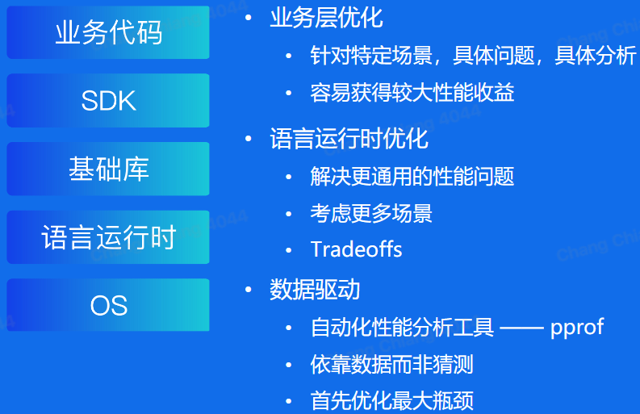

+ 性能优化与软件质量

  + 软件质量至关重要

  + 保证接口稳定的前提下改进具体实现

    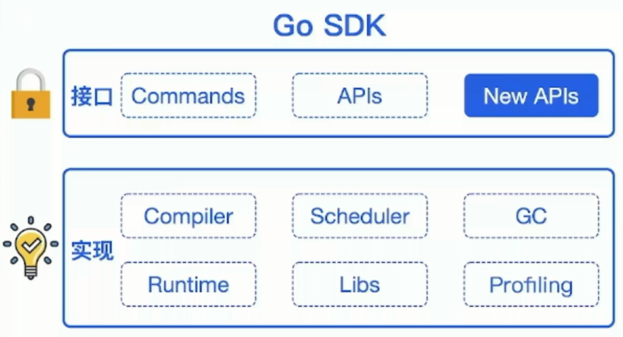

  + 测试用例：覆盖尽可能多的场景，方便回归

  + 文档：做了什么，没做什么，能达到怎样的效果

  + 隔离：通过选项控制是否开启优化

  + 可观测：必要的日志输出

## 2. 自动内存管理

### 2.1 概念

+ 动态内存

  程序在运行时根据需求动态分配的内存：`malloc()`

+ 自动内存管理（垃圾回收）

  + 避免手动内存管理，专注实现业务逻辑
  + 保证内存使用的正确性和安全性：double-free problem, use-after-free problem

+ 三个任务

  + 为新对象分配空间
  + 找到存活对象
  + 回收死亡对象的内存空间

+ 相关概念

  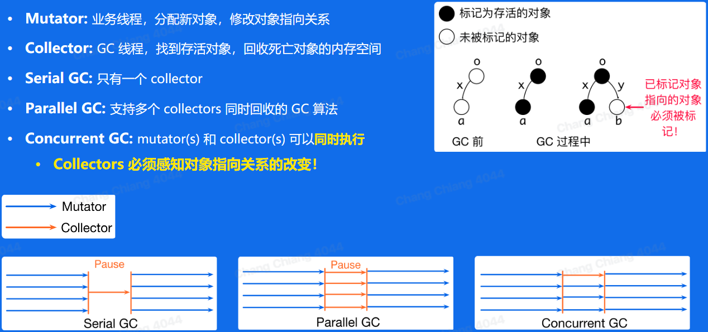

+ GC 算法评价

  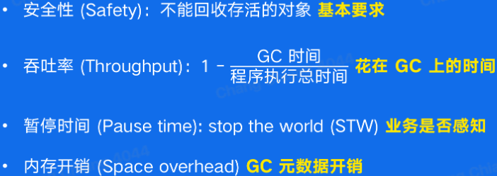

### 2.2 Tracing garbage collection

追踪垃圾回收

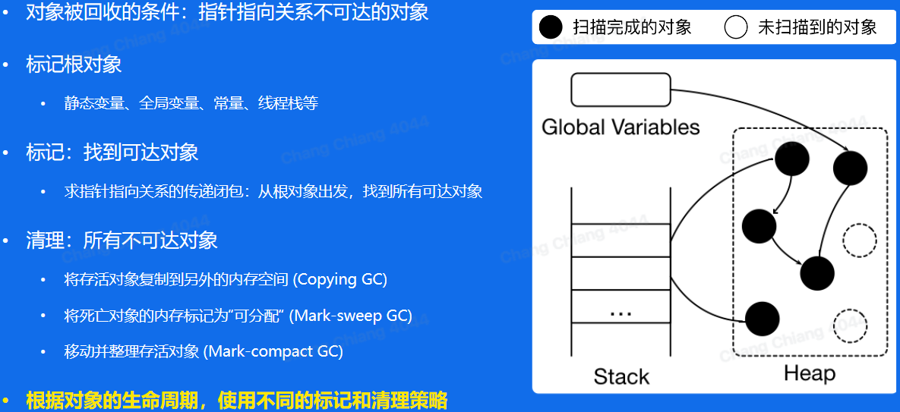

### 2.3 Generational GC

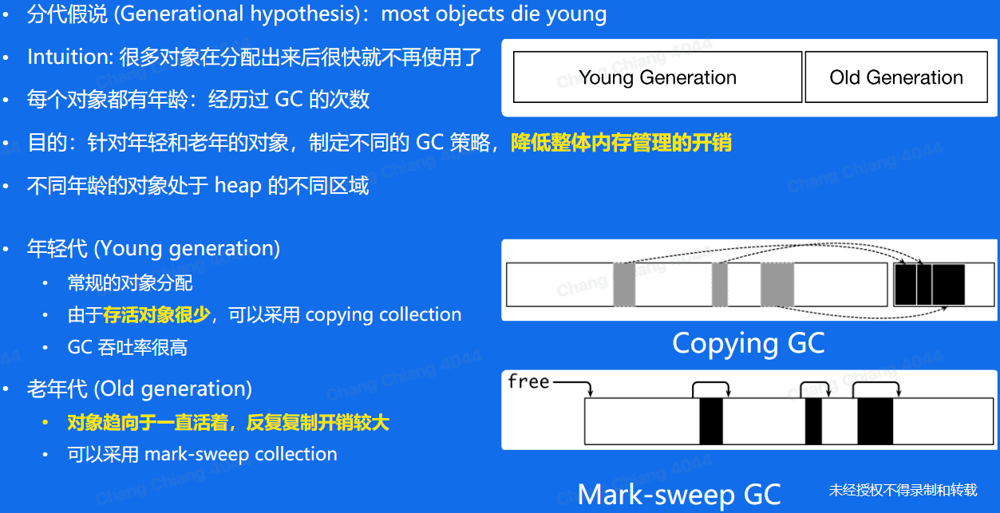

### 2.4 Reference counting

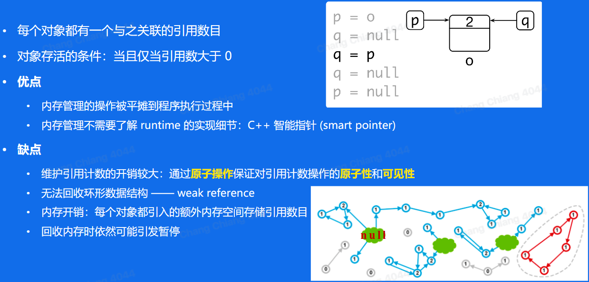

## 3. Go 内存管理及优化

### 3.1 Go 内存管理——分块

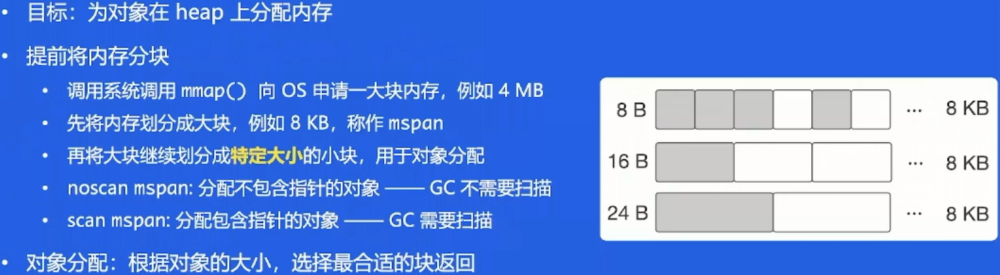

### 3.2 Go 内存管理——缓存

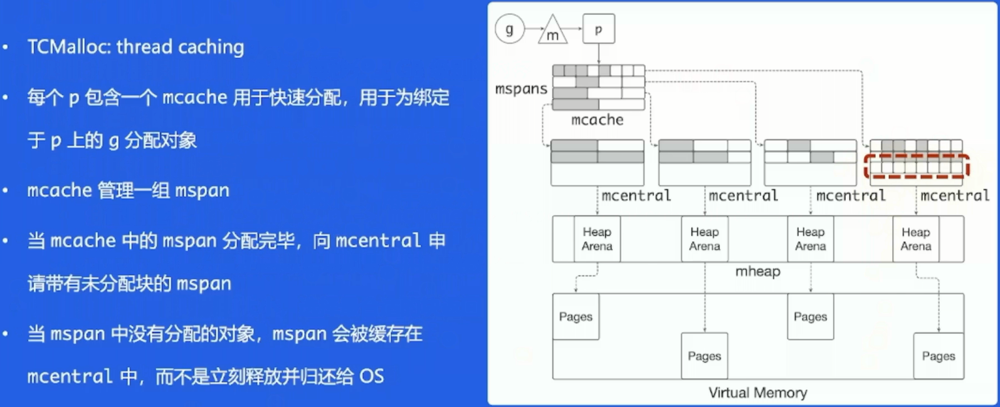

### 3.3 Go 内存管理优化——问题

### 3.4 Go 内存管理优化——Balanced GC

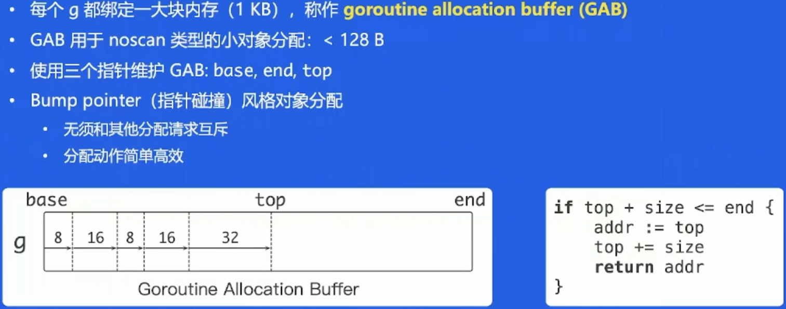

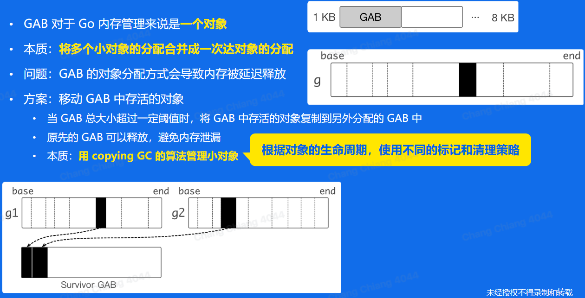

## 4. 编译器和静态分析

### 4.1 编译器的结构

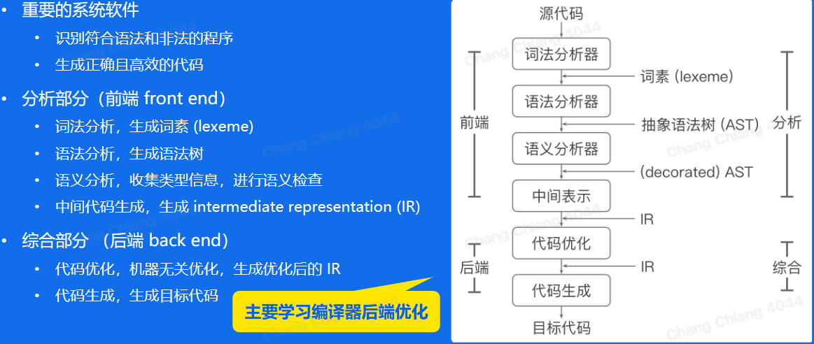

### 4.2 静态分析

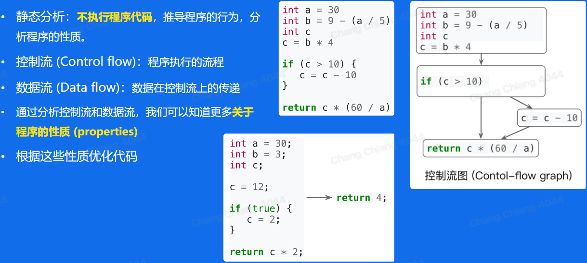

### 4.3 过程内分析和过程间分析

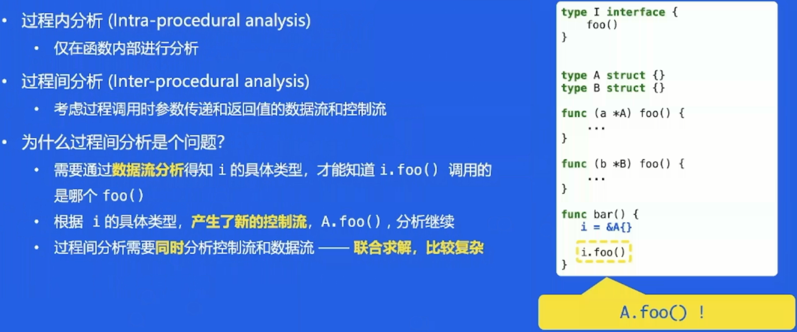

## 5. Go 编译器优化

### 5.1 问题

+ 为什么做编译器优化
  + 用户无感知，重新编译即可获得性能收益
  + 通用性优化
+ 现状
  + 采用的优化少
  + 编译时间较短，没有进行较复杂的代码分析和优化
+ 编译优化的思路
  + 场景：面向后端长期执行任务
  + Tradeoff：用编译时间换取更高效的机器码
+ Beast mode（集成在 Go SDK）
  + 函数内联
  + 逃逸分析
  + 默认栈大小调整
  + 边界检查消除
  + 循环展开
  + ···

### 5.2 函数内联 inlining

+ 内联：将被调用函数的函数体（callee）的副本替换到调用位置（caller）上，同时重写代码以反映参数的绑定

+ 优点

  + 消除函数调用开销，例如：传递参数、保存寄存器等
  + 将过程间分析转换为过程内分析，帮助其他优化，如逃逸分析

+ 缺点

  + 函数体变大，instruction cache (icache) 不友好
  + 编译生成的 Go 镜像变大

+ 函数内联在大多数情况下是正向优化

+ 内联策略

  + 调用和被调用函数的规模
  + ···

+ micro-benchmark 验证

  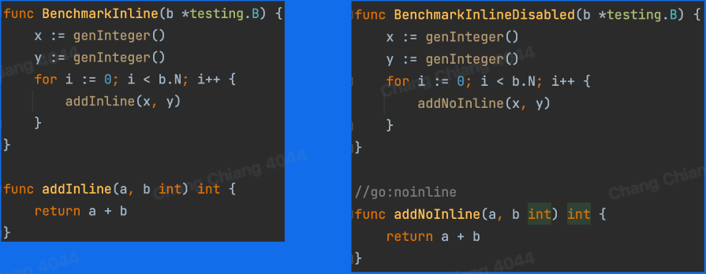

  

+ Beast Mode

  + 背景：Go 函数内联受到的限制较多
    + 语言特性，如 interface，defer 等，限制了函数内联
    + 内联策略非常保守
  + Beast mode：调整函数内联的策略，使更多函数被内联
    + 降低函数调用的开销
    + 增加了其他优化的机会：逃逸分析
  + Beast mode 带来的开销
    + Go 镜像增加 ~10%
    + 编译时间增加

### 5.3 逃逸分析

+ 概念：分析代码中指针的动态作用域（指针在何处可以被访问）
+ 大致思路
  + 从对象分配出发，沿着控制流，观察对象的数据流
  + 若发现指针 p 在当前作用域 s:
    + 作为参数传递给其他函数
    + 传递给全局变量
    + 传递给其他的 goroutine
    + 传递给已逃逸的指针指向的对象
  + 则指针 p 指向的对象逃逸出 s，反之则没有逃逸出 s
+ Beast mode：函数内联拓展了函数边界，更多对象不逃逸
+ 优化：未逃逸的对象可以在栈上分配
  + 对象在栈上分配和回收很快：移动 sp
  + 减少在 heap 上的分配，降低 GC 负担

# 三、实践

## 1. Balanced GC 优化对象分配

## 2. Beast mode 提升代码性能

# 四、总结

+ 性能优化：业务层、语言运行层
+ 自动内存管理
  + 追踪垃圾回收
  + 分代假说
  + 引用计数
+ Go 内存管理：分块、缓存、Balanced GC
+ 编译器优化：内联、逃逸分析

# 五、参考

+ [What Is Garbage Collection? | Plumbr](https://plumbr.io/handbook/what-is-garbage-collection)
+ [Vonng/ddia: 《Designing Data-Intensive Application》DDIA中文翻译 (github.com)](https://github.com/Vonng/ddia)
+ [数据密集型应用系统设计 (yuque.com)](https://www.yuque.com/fuxuemingzhu/cdpqne)
